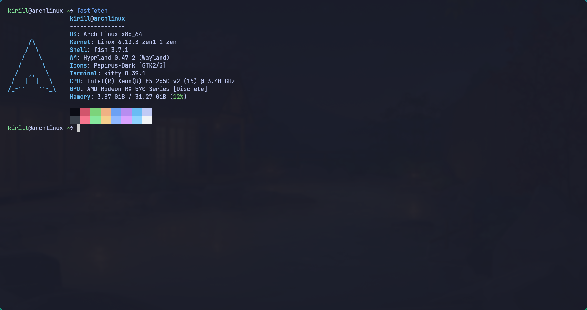
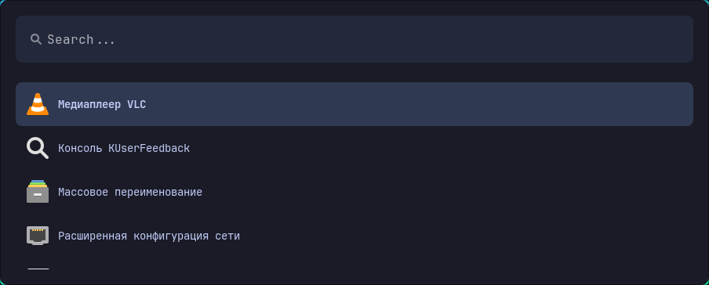
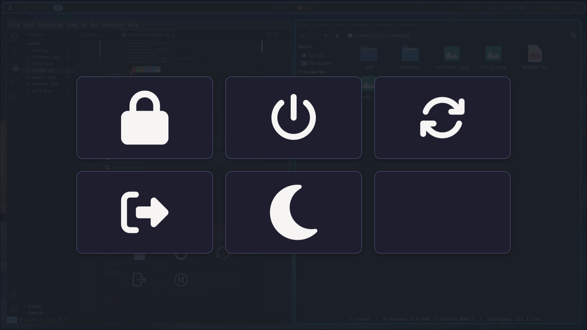
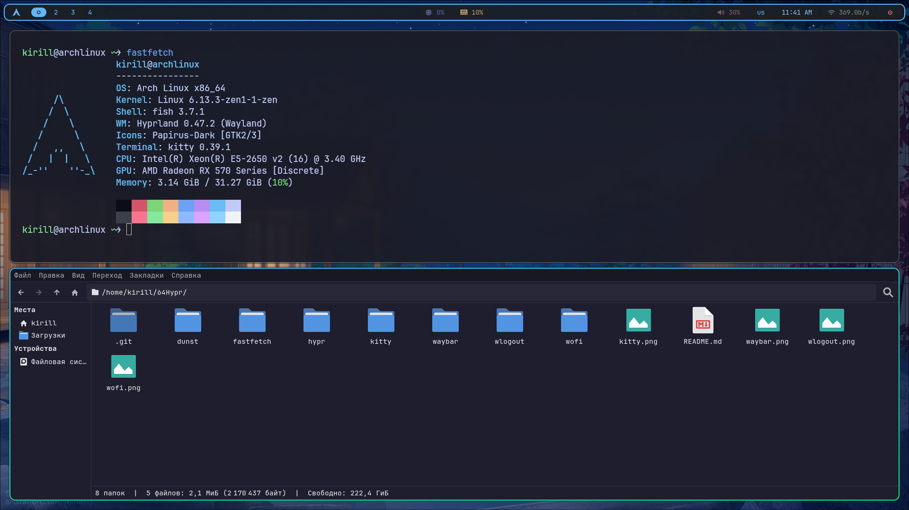

## Config for hyprland

### Install

Yay:
```
git clone https://aur.archlinux.org/yay.git
cd yay
makepkg -si
```

Packages:
```
yay -S --noconfirm waybar dunst ttf-font-awesome ttf-jetbrains-mono fastfetch wofi wlogout fish hyprpaper ttf-jetbrains-mono-nerd nwg-look thunar unzip xarchiver
```

Theme (change in nwg-look):
```
https://github.com/catppuccin/gtk/releases/tag/v1.0.3
```

Fish:
```
chsh

/bin/fish
```

Repo:
```
git clone https://github.com/64arch/64Hypr.git
cd 64Hypr
cp -r ./configs/* ~/.config/
```

### Waybar


### Kitty (+ Fish)


### Wofi


### Wlogout


### All

